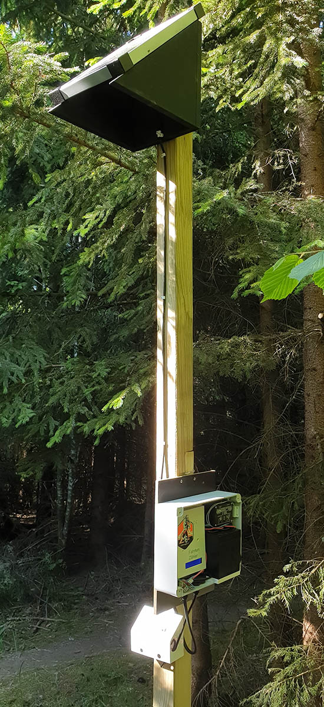
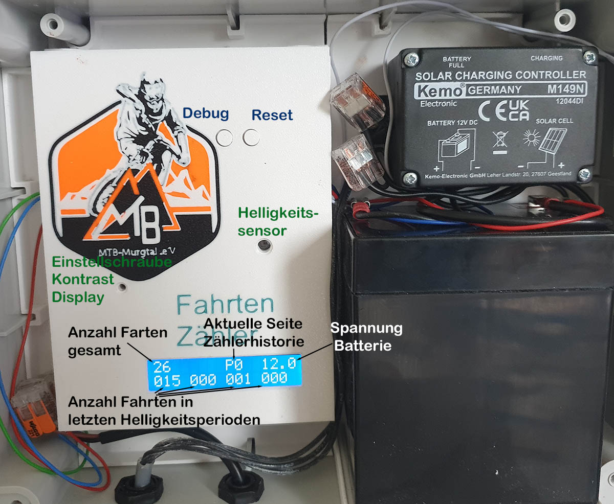
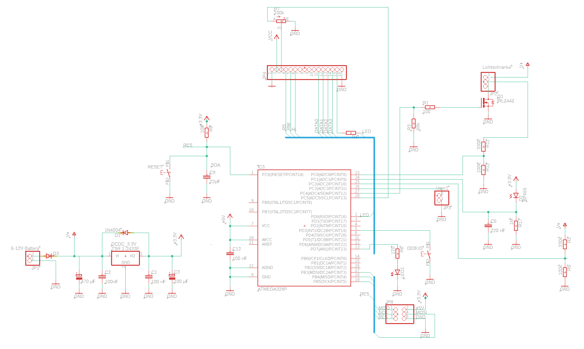

# Lichtschranke mit Unterbrechungszähler.

Diese Implementierung wurde mit dem Hintergrund erstellt, auf einem Mountain-Bike Trail die Anzahl der Durchfahrten zu messen. Mit kleineren Anpassungen, kann diese Schaltung aber auch für alles Mögliche verwendet werden.

* Ziel ist es, die Unterbrechungen der Lichtschranke zu zählen. Dies zum einen über den gesamten Lebenszyklus, wie auch auf täglicher Basis.
* Weitere Anforderung ist ein möglichst geringer Stromverbrauch, um einen Einsatz mit Batterie im Feld möglich zu machen.

# Bedienungsanleitung

An der rechten oberen Seite der Verteilerdose ist ein Magnetkontakt angebracht. Dieser kann genutzt werden, um das Display zu aktivieren. Sobald ein Magnet an das Gehäuse gehalten wird, aktiviert sich das Display für 5 Minuten.

## Display
Auf dem Display sind mehrere Zahlen abgebildet. Links oben ist die Gesamtzahl der aufgezeichneten Unterbrechungen. Diese Zahl wird mit jeder Durchfahrt um einen Zähler erhöht.

In der unteren Zeile sind die vergangenen Tage dokumentiert. Es wird immer dann eine neue Zählung begonnen, wenn der Helligkeitssensor einen Sonnenaufgang registriert oder wenn das System neu gestartet (oder resettet) wird.
Dabei steht jede Zahl für einen Tag. In dem unten abgebildeten Beispiel sind am heutigen Tag 15 Fahrten, gestern 0 und vorgestern 1 Unterbrechung gemessen worden. Der Speicher lässt nur 253 Zählungen zu, finden mehr Durchfahrten an einem Tag statt, so zeigt das Display 'MAX' an. Dies beeinflusst allerdings nicht die Zählung der gesamten Durchgänge oben links.

Um mehr als die letzten 4 Tage anzuzeigen, schaltet der Zähler mehrere Seiten durch. Jede Seite wird für 5 Sekunden angezeigt. Im Beispiel befindet sich der Zähler noch auf Seite 0, durch die Angabe 'P0'. Folglich wird auf erster stelle der aktuelle Tag und im Weiteren die vergangenen drei Tage dargestellt.
Würde hier z.B. 'P3' stehen, so rechne man einfach die (Page)3 * 4(Tage) um auf den Tag des ersten Wertes in der Vergangenheit zu kommen. In diesem Fall würde man also die Durchfahrten von vor 12, vor 13, vor 14 und vor 15 Tagen angezeigt bekommen.

Letztlich steht ganz rechts oben eine Zahl mit einer Nachkommastelle. Hierbei handelt es sich um die aktuelle Batteriespannung. Sie muss im Regelfall zwischen 9V und 14V liegen. Liegt sie darunter, lädt die Solarzelle die Batterie nicht mehr. Liegt sie darüber, ist irgendetwas magisches passiert.

Der Kontrast des Displays lässt sich mit einer Stellschraube auf halber Höhe des Zählers einstellen.

## Zähler zurück setzen.

Es ist möglich den Zähler auf 0 zurück zu setzen. Dafür muss der linke ('Debug') Knopf gedrückt und gehalten werden. Dann der rechte ('Reset' Knopf) kurz gedrückt werden, während der Debug Knopf für weitere 10 Sekunden gehalten werden muss. Das Display zählt einen Countdown herunter und meldet dann 'Speicher gelöscht'.

# Umsetzung

##Generelles Setup

Die Schaltung ist mit einer 10W Peak Solarzelle ausgestattet, die über einen Solarladeregler einen 5,4Ah Bleigelakku lädt. Diese versorgt die Schaltung über eine Sicherung (<=100mA ist ausreichend).
Aus der Versorgungsspannung wird die Lichtschranke direkt bedient und die Platine über einen 3,3V DCDC Wandler betrieben.

Die reine Zählerschaltung (ohne den Batterie-Laderegler) benötigt - je nach Batteriespannung - etwa 4mA bei Tag und 0,7mA bei Nacht.

## Programmierung

Der Code ist nicht besonders schön und beruflich würde ich ihn dem Ersteller oder der Erstellerin um die Ohren hauen. Aber da ich das während eines Feierabend-Bierchens getippselt habe, setze ich mal andere Maßstäbe an.
Um die Programmierung einfach zu halten, werden die Arduino Libraries verwendet. Das ist nicht ganz durchgängig möglich, da die Pins für den Quarz als Input verwendet werden, was die Lib nicht vorsieht.

Wird die Lichtschranke unterbrochen, so findet für weitere 300ms keine weitere Messung mehr statt. Hierdurch wird verhindert, dass ein Arm und ein darauf folgender Oberkörper nicht als 2 Radfahrer erkannt werden.

Wird der Debug Knopf gedrückt und gehalten, so zeigt das Display den aktuell gemessenen Helligkeitswert (B:) an, sowie ein D für Day oder ein N für Night. Es folgt die Versorgungsspannungsmessung, sowie die Zählung des aktuellen Tages (C:) und die Dauer der letzten Unterbrechung (D:).

## Hardware
Als Microcontroller kommt der gute ATMega328P zum Einsatz. Um den Strombedarf gering zu halten, kommt der Zähler ohne externen Quarz und operiert auf lediglich 1 MHz per Fuses Einstellung.
Dadurch liegt die maximale Auflösung bei 15ms. Grob über den Daumen gepeilt könnte es also sein, dass Radfahrer die mit mehr als 80 km/h auf dem Trail unterwegs sind nicht mehr erfasst werden.

Die aktuell erstellte Version wurde prototypisch auf einer Lochstreifenplatine erstellt. Spätere Versionen können bei erfolgreichem Dauertest auch auf professioneller gelayouteten Platinen umgesetzt werden.
Die momentane Implementierung speichert jeden Durchgang. Dadurch werden auch dann Zählungen gespeichert, wenn der Strom unerwartetet ausfällt. Nachteil ist die begrenzte Haltbarkeit des Speicherchips, der nur 100.000 Speichervorgänge garantiert.
Der Chip ist auf einen Sockel gesteckt und kann so einfach getauscht werden.

Generell sind die Widerstände eher großzügig zu Lasten den Genauigkeit dimensioniert mit dem Hintergedanken Strom zu sparen.

Die aktuelle Version arbeitet mit einem Hitatchi Display. Ich denke in den nächsten Versionen sollte ich dem ganzen ein LCD Display spendieren, das ist irgendwie cooler und braucht auch nicht ganz so viele Datenleitungen. 

Als Phototransistor kommt der BP 103B-2 zum Einsatz. Für diesen Zweck nicht optimal, aber ich habe ihn mit einem sehr hohen Widerstand und einem Kondensator gebändigt. Dadurch ist die Messung sehr ungenau, aber um Hell und Dunkel zu unterscheiden reicht es.

Ein Verpolungsschutz wird durch eine Diode in Durchgangsrichtung realisiert. Auf die 0,7 Volt kommt es auch nicht mehr an. 

Zum Programmieren ist ein 6 poliger standard Pinheader vorgesehen. Theoretisch muss man aufpassen, dass der Programmer mit 3,3V arbeitet, praktisch kann das Teil eine kurze Überspannung auf 5 V während des Programmierens ab.

